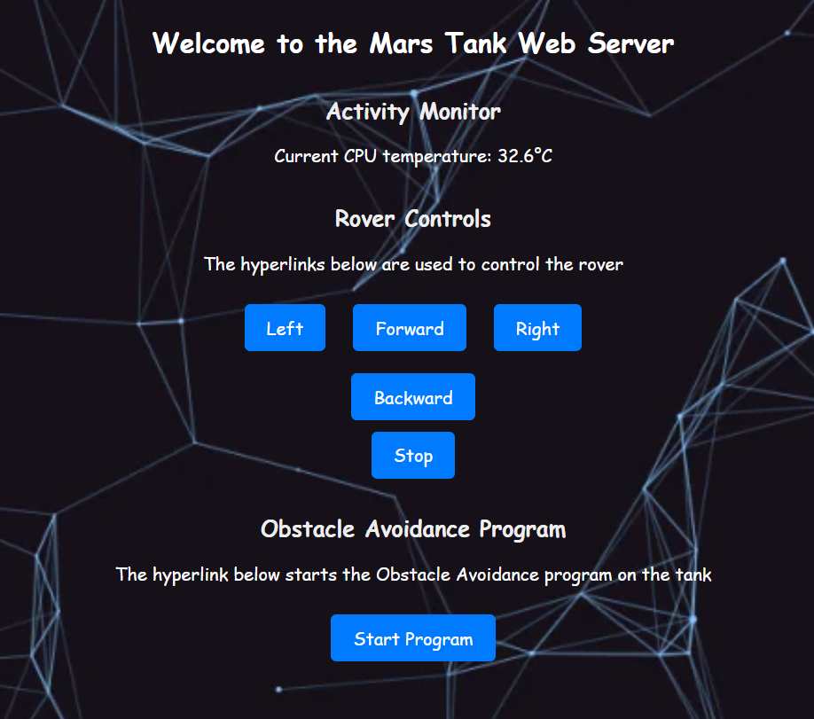

# Mars Tank Prototype

Welcome to the Mars Tank Prototype project. This document provides an overview of the project, its objectives, current status, and future plans.

## Overview

The primary aim of this project is to create a fully autonomous Mars Tank Prototype. It combines hardware and software components to enable autonomous navigation in a Mars-like environment. Key components include:

- Controlling the Mars Tank using a 2x7A Roboclaw Motor Controller.
- Establishing a Bluetooth connection to a PS4 controller for remote control.
- Implementing Python code for precise control of the tank's movements.
- Developing a web server for remote control and monitoring.
- Incorporating obstacle avoidance using HRSC04 Ultrasonic Sensors.

By integrating these elements, we aim to build a versatile tank prototype capable of autonomous exploration and navigation.

## Objectives and Motivation

This project was initiated during the 11th grade as a means to explore interests in electrical and computer engineering, programming, and embedded systems design. The primary goals were to gain hands-on experience with a Raspberry Pi, improve Python programming skills, enhance technical capabilities, and learn PCB design.

## Table of Contents

- [Parts List](#parts-list)
- [Current Build](#current-build)
   - [PCB Addition](#pcb-addition)
- [Mobilizing the Tank](#mobilizing-the-tank)
   - [Remote Control via PS4 Controller](#remote-control-via-ps4-controller)
   - [Remote Control via Webservers](#remote-control-via-webservers)
     - [HTML-Based Server](#html-based-server)
     - [Node-RED Server](#node-red-server)
- [Autonomous Tank Programs](#autonomous-tank-programs)
   - [Obstacle Avoidance Tank](#obstacle-avoidance-tank)
     - [Obstacle Avoidance Algorithm](#obstacle-avoidance-algorithm)
     - [Obstacle Avoidance Code](#obstacle-avoidance-code)
- [Future Plans](#future-plans)

## Parts List

Here's the updated list of parts used in this project:

- [Bogie Runt Rover Kit from ServoCity](https://www.servocity.com/bogie-runt-rover/) (Includes 6 140RPM Motors)
- 2 Lithium Polymer batteries rated at 3.7V 2000 mAh
- [2x7A Roboclaw Motor Controller](https://www.servocity.com/roboclaw-2x7a-motor-controller/)
- Raspberry Pi 4 (8GB RAM)
- Half-Size Breadboard
- 3 HD-SR04 Ultrasonic Range Sensors
- Anker 20100 mAh Battery Pack (for Raspberry Pi)
- PS4 Controller
- Jumper Wires
- USB Camera (Optional with VLC - Launched Separately)

## Current Build

Version 2.0 of the current tank design includes several significant improvements compared to the initial version. These enhancements focus on streamlining functionality and include:

- Removal of non-essential sensors for autonomous travel.
- Introduction of a new battery supply for the Raspberry Pi.
- Optimization of component layout to improve the center of mass.
- Addition of two ultrasonic sensors on the left and right sides.

### PCB Addition

To optimize space within the tank, a custom-designed PCB using Autodesk Eagle and Udemy courseware was created to replace the breadboard circuit connecting the ultrasonic sensors and motors. This transition enhances efficiency and allows the breadboard to be used for prototyping other circuits with different sensors.

## Mobilizing the Tank

The tank can be mobilized using three methods:

### Remote Control via PS4 Controller

This method requires specific Python libraries, including the "roboclaw_3" library for Python 3, and the [pyPS4Controller](https://github.com/ArturSpirin/pyPS4Controller) for PS4 controller communication. By combining these libraries, the tank can be controlled with the PS4 controller, enabling basic movements such as forward, backward, left rotation, and right rotation. The corresponding code for this component is named "tank_control_algorithm."

### Remote Control via Webservers

#### HTML-Based Server

An HTML-based server was created using Python's built-in HTTP server library. It allows for remote control of the tank through hyperlinks on a web page. Additionally, the server monitors the Raspberry Pi's CPU temperature and can initiate the obstacle avoidance program with a button click.

#### Node-RED Server

Node-RED, a flow-based programming tool, was set up on the Raspberry Pi to serve as the control interface for the tank. This interface enables the creation of custom user interfaces for controlling hardware devices within the local network.

##### Setup

Node-RED can be installed on a Raspberry Pi using [these instructions](https://nodered.org/docs/getting-started/raspberrypi).

##### My Node-RED User Interface

I used Node-RED to control the Raspberry Pi on the UI Tank. I have set up different webpages on the server to monitor and control different aspects of the prototype tank.

**Homepage:**

On the homepage, I can perform essential tasks such as shutting down or rebooting the Pi as needed. Additionally, I can update the Pi and trigger the HTML server program remotely, initiating the web server.

**System Monitoring:**

Another dedicated page monitors vital system parameters, including the Pi's CPU temperature and available memory. This feature is particularly helpful if the Pi experiences performance issues, allowing me to identify potential overheating or memory saturation problems.

**Tank Control:**

To operate the tank, I've implemented switches that enable control of its movements: forward, backward, left, right, and stop. Additionally, I've created a page that facilitates remote initiation of the Obstacle Avoidance program using a simple switch. These pages streamline tank testing, eliminating the need for a monitor or VNC server. The Raspberry Pi is configured to automatically launch Node-RED on startup, ensuring quick accessibility.

In forthcoming iterations, I plan to expand the webserver's functionality by incorporating additional features and statistics, enhancing its utility when the tank operates autonomously.

## Autonomous Tank Programs

### Obstacle Avoidance Tank

One of the key autonomous programs implemented in this project is obstacle avoidance using HRSC04 Ultrasonic Sensors. This feature enhances the tank's capability to navigate and explore autonomously.

#### Obstacle Avoidance Algorithm

The obstacle avoidance algorithm works as follows:

- The front sensors' responsibility is to detect objects that may be less than 30 cm from the tank.
- If there is an object detected, the left and right sensors also check for obstacles within 15 cm from the tank.
- If one side has a clearance of more than 15 cm, the tank is instructed to rotate in the direction of least obstruction.
- This loop continues indefinitely, allowing the tank to navigate autonomously and avoid obstacles.

#### Obstacle Avoidance Code

The code for this obstacle avoidance program is listed as "Obstacle_Avoidance.py" in the [GitHub repository](https://github.com/kabirvirk51/mars-tank-prototype/blob/main/python-scripts/obstacle_avoidance.py).

## Future Plans

Currently, work is underway to implement lane tracking algorithms using OpenCV functions, as well as to master PCB design utilizing Autodesk Eagle. Additionally, various components, including an LCD display for real-time data such as temperature and distance traveled, are being integrated. These enhancements aim to simulate a Mars tank, and updates are planned for the summer of 2024.

**Disclaimer:** This project was completed over two months during the summer of 2023, and further developments are in progress. Thank you for your interest, and stay tuned for updates!
